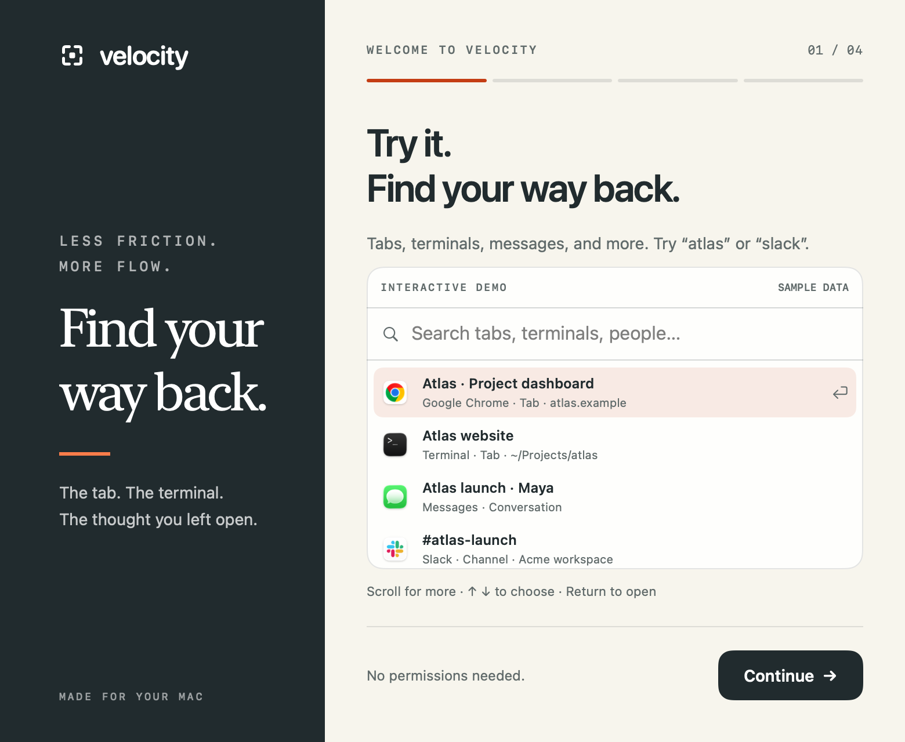
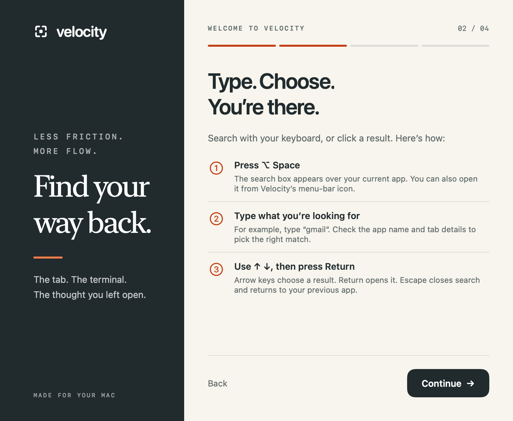
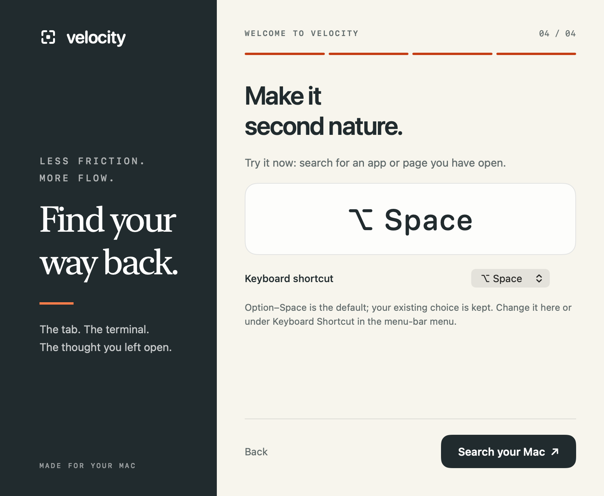

# Velocity

**Chrome’s Command–Shift–A, for your whole Mac.**

You know Chrome’s tab search: press a shortcut, type a few words, and jump straight to the tab. Velocity brings that experience across your browser tabs, terminal sessions, app windows, and open AI conversations.

Press **Command–Shift–A**, type what you’re looking for, and hit **Return**. One search box. One list. The agent waiting for your answer, the ChatGPT conversation open in a browser tab, the Claude session in a terminal, the document you were editing—all within reach.

- **Find work across apps.** Search titles, browser URLs, app names, and exposed project or document paths.
- **See which agents need you.** Recognized input requests rise to the top, with optional notifications.
- **Find what’s making noise.** Audio indicators and Chrome profile badges help distinguish results.
- **Pick up where you left off.** Recent destinations rise in the list; apps can launch even when they’re closed.

Velocity discovers open Chrome and Safari tabs, accessible terminal tabs and app windows, and exposed Claude projects. AI conversations are searchable through those open tabs and windows; it does not index your entire ChatGPT or Claude conversation history. Availability depends on what each app exposes.

Native macOS menu-bar app. macOS 14+. The public build runs locally and makes no AI requests.

[**Download Velocity**](https://github.com/magicseth/velocity/releases/tag/v0.1.13)


*Native app views rendered with fictional sample data. Regenerate with `bash scripts/screenshots.sh` on macOS.*

## Onboarding preview

Try Velocity before granting permissions. The upcoming onboarding includes a hands-on demo with fictional browser tabs, terminals, Messages conversations, Slack channels, and workspaces. Search **atlas** to find related work across apps, then choose a result with the keyboard or mouse.



<table>
<tr>
<td width="50%"></td>
<td width="50%"></td>
</tr>
<tr><td><strong>Learn by doing.</strong> Search, choose, and return to your work.</td><td><strong>Make it yours.</strong> Choose a shortcut that fits your Mac.</td></tr>
</table>

*Rendered from the native SwiftUI onboarding with fictional sample data. This previews the upcoming onboarding; the v0.1.13 download above does not include this flow yet.*

## Download

Download the macOS Apple silicon build from [Releases](https://github.com/magicseth/velocity/releases). Unzip it and move **Terminal Velocity.app** to Applications. The app retains its original name and bundle identifier in this preview.

The release is Developer ID signed but **not notarized**. macOS may require approval in System Settings → Privacy & Security before first launch. Requires macOS 14 or later; the downloadable binary is arm64. Intel Macs can build from source.

## Updates

Click Velocity’s menu-bar icon and choose **Check for Updates…**. If a newer version is available, choose **Download & Restart**. Velocity checks GitHub, verifies the download checksum and Developer ID signature, installs in place, and restarts with your settings intact. Keep the app in a writable folder, such as your Applications folder.

Public builds update to public builds; experimental builds update to the separate `-experimental.zip` asset. The standard download keeps objectives and synopses disabled. Versions before 0.1.5 need one manual download to gain the updater. Updates are checked only when you ask; no window titles or conversation data are sent to GitHub.

## Build and run

```sh
bash scripts/build.sh
open "dist/Terminal Velocity.app"
```

The build script uses a Developer ID Application identity from your keychain, or the identity specified in `CODE_SIGN_IDENTITY`. This keeps the app's signing requirement stable across rebuilds. The local build is signed but not notarized for distribution. An explicit `CODE_SIGN_IDENTITY=- bash scripts/build.sh` creates an ad-hoc build whose Accessibility grant may reset after updates.

On first launch, enable **Terminal Velocity** in **System Settings → Privacy & Security → Accessibility**. Reopen the palette or click refresh after enabling it. Keep the app in a stable location. If upgrading from an ad-hoc build, remove its old Accessibility entry and add the newly signed app once.

## Use

- **Command–Shift–A** to open / dismiss search. Click the menu-bar icon for search and settings. This is a global shortcut and takes priority over Chrome’s tab search while Velocity runs. Existing installations keep their chosen shortcut; change it from the menu-bar menu.
- Installed apps in `/Applications`, `/System/Applications`, and `~/Applications` are searchable even when closed. Choose a **Launch app** result to open it.
- Type any part of an app name, window title, URL, or exposed document path. Project and folder names in those fields work too; document contents are not indexed.
- Use `@AppName` or `app:"Visual Studio Code"` for any app, and `folder:"My Projects"` for document parent folders. Folder metadata depends on the app exposing its document URL; inactive tabs never inherit the selected document’s path.
- `@recent`, `@audio`, `@playing`, `@muted`, `@tabs`, `@windows`, and `@minimized` narrow results and combine with app filters and plain words.
- Recently used windows and exposed tabs automatically rank first among equally relevant matches, including switches outside Terminal Velocity. App activation notifications and a one-second foreground check update recents while the palette is closed. On an empty search, previous destinations precede the current one. Very brief visits between checks and inaccessible tab selections may not be captured. **Option–Command–1…9** opens a numbered result; **Command–/** opens keyboard help.
- The window list refreshes every 12 seconds while open.
- Standard **Command–A / C / V / X / Z** editing shortcuts work in the search field.
- **↑ / ↓** select a result; **Return** focuses it; **Escape** returns to your previous app.
- Click **×** beside a result to close that tab or window, or quit an app-only result. Native save/process prompts remain in the owning app. Launchable apps and saved chat projects have no close button.
- **Command–R** refreshes the list.
- Click the menu-bar icon to change the shortcut or quit.

The list includes windows exposed by each app’s Accessibility implementation, including minimized and hidden windows, plus named tab controls exposed in window chrome. Tab results bring the containing window forward, then select the requested tab. Apps with no exposed windows appear as application results. Apps that do not expose accessible tab controls cannot have their inactive tabs indexed this way. Full-screen windows and other Spaces are subject to macOS and the target app’s window-switching behavior.

## Agent attention and prompts

Agent requests appear at the top of the unified list when the search is empty. `@attention` and `@waiting` select explicit input requests; `@ready` separately selects idle hints. `@agents` includes recognized working titles too.

Codex’s `[ ! ] Action Required` and `[ . ] Action Required` title prefixes indicate user input. Claude’s `✳` prefix is an idle hint, not proof of a permission request; `◐` / `◑` indicate work in supported versions. Claude detection also requires its name in the terminal title. Custom titles, terminal multiplexers, disabled title updates, and version differences can hide these signals. Known terminal titles refresh alongside audio every two seconds, including while the palette is closed.

Select a terminal and press **Command–I** (or right-click → **Inspect prompt…**) for the last 6,000 characters of accessible terminal text. This is a manually refreshed snapshot and may include other recent output. Inactive tabs without accessible selection/text require opening first. **Open to answer** focuses the terminal; this app does not send approval keystrokes or answer prompts automatically. Preview text stays in memory.

## Chrome, Safari, and audio

Click **Enable** in the browser-tabs banner, then allow Terminal Velocity to control Chrome and Safari when macOS asks. This reads tab titles and URLs from all open browser windows through their scripting interfaces. It does not read webpage contents. Tab results are searchable by title, URL, or browser name. Chrome targets stable tab IDs, including when tabs move between windows. Safari validates the original tab or a unique title/URL match if its tabs were reordered; a closed or ambiguous result fails safely. Closed Safari tab groups and tabs on other devices are not open windows and are outside this list.

Speaker badges update every two seconds while the app is running:

- **Playing audio / Muted**: the browser's accessible tab audio annotation or mute control. These are available only for tabs whose controls the browser exposes. English audio labels are currently recognized; ambiguous duplicate-title mappings are left unmarked unless their window and tab order can be matched.
- **App audio**: macOS reports an active audio output stream for this process or an identifiable helper inside its app bundle (macOS 14.2+). It does not identify the individual window or guarantee non-silent output. The badge is shared by that app's window results; it is not copied onto every browser tab.

The optional `@audio` search includes playing, muted, and app-output results. No microphone access, screen recording, or audio capture is used. Titles, URLs, paths, and audio state remain in memory locally. The last 80 used window/tab identifiers are stored locally as hashes with selection timestamps for recent ranking.

To start at login, add the built app in System Settings → General → Login Items. The native app has no third-party Swift dependencies and uses no screen recording. Keyboard handling is limited to its palette and registered system shortcuts. The optional Convex backend has its own Node dependencies.

## Checks

```sh
swift test
"dist/Terminal Velocity.app/Contents/MacOS/TerminalVelocity" --list-windows
```

The diagnostic command needs its own Accessibility authorization when launched from a terminal. Live window discovery and focusing require an interactive authorized macOS session.

## Agent notifications

When a terminal title reports **Action Required**, TV sends a native macOS notification with sound and keeps an attention count in the menu bar. Clicking the banner or menu-bar icon opens the unified list with attention first. Window/tab duplicates and blinking title markers produce one alert; brief title-read gaps do not retrigger it. Idle titles alone do not notify because they do not prove an agent has a question.

Allow notifications when macOS asks. Right-click TV’s menu-bar icon for **Agent Notifications**, **Test Notification**, and **Notification Settings**. macOS notification settings and Focus control banner and sound delivery. Detection runs while TV is running and has Accessibility access; no terminal contents are sent to a server for notifications.

Opening Velocity from its shortcut or menu-bar icon shows all apps in one list. Agents needing input come first when the search is empty, followed by audio items, then the usual recent results. Notification clicks open the same list. Matching window/tab attention entries are merged in the unified list.

## Chat app projects

Search `@projects` to find Claude projects. TV indexes project names and links exposed by Claude’s sidebar and All projects screen, including its Chat/Cowork and Code modes, and retains discovered metadata locally across mode changes and app restarts. Open **All projects** in Claude to expose projects missing from the sidebar. This is an index of discovered projects, not a full account API; deleted projects can remain cached until the index is refreshed in a future version. Project selection navigates within Claude without sending a message.

Project indexing currently supports Claude. ChatGPT/Codex remains available through ordinary window search.

## Experimental builds

Objectives, window grouping, AI grouping, and title-derived agent synopses are disabled in public downloads. They remain available together through a build-time opt-in; there is no public settings toggle. See [experimental build instructions](docs/experimental.md).

### Menu bar placement

Velocity automatically checks whether its menu-bar icon is visible and clear of the notch. If the icon is hidden, clipped, or offscreen, a small **Velocity** button appears below the menu bar in the screen’s safe area. It disappears after the normal icon becomes accessible again. Click either button to open the same menu, including search, settings, updates, and quit. **Command–Shift–A** still opens search directly. This fallback keeps Velocity accessible; it does not rearrange other apps’ menu-bar items.

### Native tab cleanup

Choose **Clean up tabs** in Velocity or **Clean Up Tabs…** in its menu. It uses the same macOS Accessibility and browser Automation permissions as tab search; no browser extension is needed. Chrome and Safari are supported.

- **Remove exact duplicates** closes eligible extra copies in each browser window with one click, keeping at least one copy. Full URLs must match, including query strings and fragments; copies in different windows or profiles are kept separate. It does not run unattended.
- **Old-tab review** starts tracking activity locally when this version runs. Choose 7, 14, 30, or 90 days without observed activity, check the tabs you want removed, and close the selection. It does not read past browser history and can miss activity between scans or while Velocity is quit.
- Selected tabs, Chrome tabs that are loading, tabs with detected audio, and tabs without a reliable Accessibility match are excluded. Detected pinned tabs are excluded, but browsers do not expose every pinned state. Tabs are revalidated before closing; browser confirmation dialogs are never answered automatically.
- **Recently closed** retains the last 100 cleanup URLs locally for reopening. This restores the URL, not unsaved page state or the original browser profile. Activity records store hashed identifiers and timestamps locally. No tab metadata is sent to AI.

Cleanup does not move tabs or create browser tab groups.

### Conductor workspaces

Velocity searches workspace links exposed in Conductor’s sidebar. Search by workspace name or `Conductor`, then press Enter to open the exact workspace. Duplicate names are distinguished internally by workspace ID. Keep the sidebar open and expand a repository to expose its workspaces; collapsed or hidden entries are not indexed yet. No Conductor API token or extension is needed, and conversation contents are not indexed.

Open windows, tabs, and workspaces sort ahead of applications that need launching, including when searching by name.

### Messages and Slack conversations

Search recipient or group names from Messages, and channel or DM names from Slack, then press Enter to open the sidebar destination. Uses existing Accessibility permission—no extension, Slack token, or additional account connection. Conversation results cannot be closed with the row’s close action.

This indexes the navigation entries currently exposed by each app, not its full history or directory. Keep the sidebar open and expand Slack sections; only the active Slack workspace is scanned. Hidden or unloaded conversations are not indexed. Messages labels are shortened before the first comma to exclude message previews; names containing commas may be shortened. Ambiguous duplicate names are omitted. Names stay in the local search index; message bodies are not indexed or uploaded.

### Local agent access

The optional **Agent Access…** panel provides project-scoped resource discovery, approval requests for supported open/close actions, expiring grants, revocation, and a local audit log. Access starts off and resources start private. See the [setup, API, and security boundaries](docs/agent-access.md).
