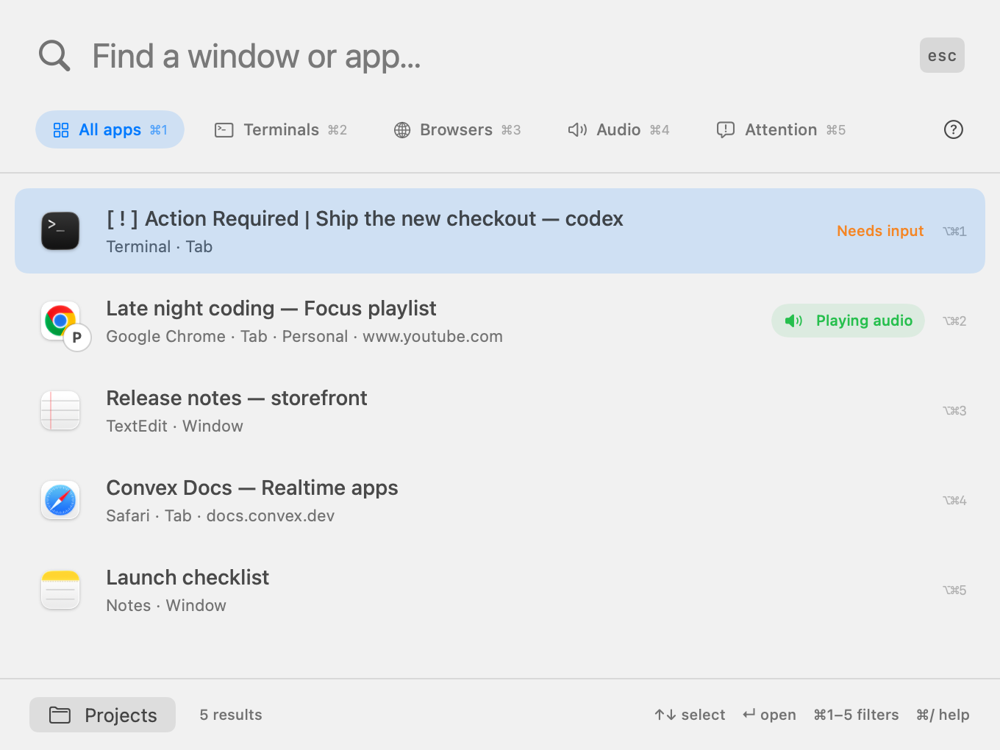

# Velocity

A native macOS menu-bar window switcher. Search running apps and their window titles, then press Return to jump to a result. The public build runs locally and makes no AI requests. Requires macOS 14 or later.



*Native app views rendered with fictional sample data. Regenerate with `bash scripts/screenshots.sh` on macOS.*

## Download

Download the macOS Apple silicon build from [Releases](https://github.com/magicseth/velocity/releases). Unzip it and move **Terminal Velocity.app** to Applications. The app retains its original name and bundle identifier in this preview.

The release is Developer ID signed but **not notarized**. macOS may require approval in System Settings → Privacy & Security before first launch. Requires macOS 14 or later; the downloadable binary is arm64. Intel Macs can build from source.

## Build and run

```sh
bash scripts/build.sh
open "dist/Terminal Velocity.app"
```

The build script uses a Developer ID Application identity from your keychain, or the identity specified in `CODE_SIGN_IDENTITY`. This keeps the app's signing requirement stable across rebuilds. The local build is signed but not notarized for distribution. An explicit `CODE_SIGN_IDENTITY=- bash scripts/build.sh` creates an ad-hoc build whose Accessibility grant may reset after updates.

On first launch, enable **Terminal Velocity** in **System Settings → Privacy & Security → Accessibility**. Reopen the palette or click refresh after enabling it. Keep the app in a stable location. If upgrading from an ad-hoc build, remove its old Accessibility entry and add the newly signed app once.

## Use

- **Control–Option–K** or click the menu-bar icon: open / dismiss search.
- Installed apps in `/Applications`, `/System/Applications`, and `~/Applications` are searchable even when closed. Choose a **Launch app** result to open it.
- Type any part of an app name, window title, URL, or exposed document path. Project and folder names in those fields work too; document contents are not indexed.
- Use `@AppName` or `app:"Visual Studio Code"` for any app, and `folder:"My Projects"` for document parent folders. Folder metadata depends on the app exposing its document URL; inactive tabs never inherit the selected document’s path.
- `@recent`, `@audio`, `@playing`, `@muted`, `@tabs`, `@windows`, and `@minimized` narrow results and combine with app filters and plain words.
- Recently used windows and exposed tabs automatically rank first among equally relevant matches, including switches outside Terminal Velocity. App activation notifications and a one-second foreground check update recents while the palette is closed. On an empty search, previous destinations precede the current one. Very brief visits between checks and inaccessible tab selections may not be captured. **Option–Command–1…9** opens a numbered result; **Command–/** opens keyboard help.
- The window list refreshes every 12 seconds while open.
- Standard **Command–A / C / V / X / Z** editing shortcuts work in the search field.
- **↑ / ↓** select a result; **Return** focuses it; **Escape** returns to your previous app.
- **Command–T** toggles terminals only; **Command–R** refreshes the list.
- **Command–B** toggles browser results; **Command–Shift–A** toggles the Audio filter.
- **Command–1 / 2 / 3 / 4** selects All apps / Terminals / Browsers / Audio, preserving the search text.
- Right-click the menu-bar icon to change the shortcut or quit.

The list includes windows exposed by each app’s Accessibility implementation, including minimized and hidden windows, plus named tab controls exposed in window chrome. Tab results bring the containing window forward, then select the requested tab. Apps with no exposed windows appear as application results. Apps that do not expose accessible tab controls cannot have their inactive tabs indexed this way. Full-screen windows and other Spaces are subject to macOS and the target app’s window-switching behavior.


## Agent attention and prompts

**Command–5** opens Attention: only terminal results whose titles explicitly indicate **Needs input**. `@attention` and `@waiting` select explicit input requests; `@ready` separately selects idle hints. `@agents` includes recognized working titles too.

Codex’s `[ ! ] Action Required` and `[ . ] Action Required` title prefixes indicate user input. Claude’s `✳` prefix is an idle hint, not proof of a permission request; `◐` / `◑` indicate work in supported versions. Claude detection also requires its name in the terminal title. Custom titles, terminal multiplexers, disabled title updates, and version differences can hide these signals. Known terminal titles refresh alongside audio every two seconds, including while the palette is closed.

Select a terminal and press **Command–I** (or right-click → **Inspect prompt…**) for the last 6,000 characters of accessible terminal text. This is a manually refreshed snapshot and may include other recent output. Inactive tabs without accessible selection/text require opening first. **Open to answer** focuses the terminal; this app does not send approval keystrokes or answer prompts automatically. Preview text stays in memory.


## Chrome, Safari, and audio

Click **Enable** in the browser-tabs banner, then allow Terminal Velocity to control Chrome and Safari when macOS asks. This reads tab titles and URLs from all open browser windows through their scripting interfaces. It does not read webpage contents. Tab results are searchable by title, URL, or browser name. Chrome targets stable tab IDs, including when tabs move between windows. Safari validates the original tab or a unique title/URL match if its tabs were reordered; a closed or ambiguous result fails safely. Closed Safari tab groups and tabs on other devices are not open windows and are outside this list.

Speaker badges update every two seconds while the app is running:

- **Playing audio / Muted**: the browser's accessible tab audio annotation or mute control. These are available only for tabs whose controls the browser exposes. English audio labels are currently recognized; ambiguous duplicate-title mappings are left unmarked unless their window and tab order can be matched.
- **App audio**: macOS reports an active audio output stream for this process or an identifiable helper inside its app bundle (macOS 14.2+). It does not identify the individual window or guarantee non-silent output. The badge is shared by that app's window results; it is not copied onto every browser tab.

The **Audio** filter includes playing, muted, and app-output results. No microphone access, screen recording, or audio capture is used. Titles, URLs, paths, and audio state remain in memory locally. The last 80 used window/tab identifiers are stored locally as hashes with selection timestamps for recent ranking.

To start at login, add the built app in System Settings → General → Login Items. The native app has no third-party Swift dependencies and uses no screen recording. Keyboard handling is limited to its palette and registered system shortcuts. The optional Convex backend has its own Node dependencies.

## Checks

```sh
swift test
"dist/Terminal Velocity.app/Contents/MacOS/TerminalVelocity" --list-windows
```

The diagnostic command needs its own Accessibility authorization when launched from a terminal. Live window discovery and focusing require an interactive authorized macOS session.


## Agent notifications

When a terminal title reports **Action Required**, TV sends a native macOS notification with sound and keeps an attention count in the menu bar. Clicking the banner opens Attention; the menu-bar icon opens All apps with attention first. Window/tab duplicates and blinking title markers produce one alert; brief title-read gaps do not retrigger it. Idle titles alone do not notify because they do not prove an agent has a question.

Allow notifications when macOS asks. Right-click TV’s menu-bar icon for **Agent Notifications**, **Test Notification**, and **Notification Settings**. macOS notification settings and Focus control banner and sound delivery. Detection runs while TV is running and has Accessibility access; no terminal contents are sent to a server for notifications.

Opening Velocity from its shortcut or menu-bar icon resets to **All apps**. Agents needing input come first when the search is empty, followed by audio items, then the usual recent results. An explicit notification click still opens Attention. Matching window/tab attention entries are merged in All apps too.


## Chat app projects

Click **Projects** or search `@projects` to find Claude projects. TV indexes project names and links exposed by Claude’s sidebar and All projects screen, including its Chat/Cowork and Code modes, and retains discovered metadata locally across mode changes and app restarts. Open **All projects** in Claude to expose projects missing from the sidebar. This is an index of discovered projects, not a full account API; deleted projects can remain cached until the index is refreshed in a future version. Project selection navigates within Claude without sending a message.

Project indexing currently supports Claude. ChatGPT/Codex remains available through ordinary window search.

## Experimental builds

Objectives, window grouping, AI grouping, and title-derived agent synopses are disabled in public downloads. They remain available together through a build-time opt-in; there is no public settings toggle. See [experimental build instructions](docs/experimental.md).
