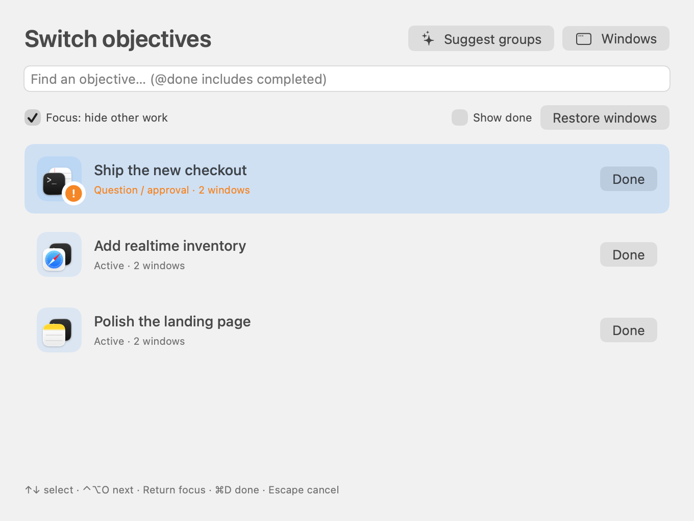

# Experimental agent features

These features are disabled in the default build and public release downloads. Opt in explicitly:

```sh
VELOCITY_EXPERIMENTAL=1 bash scripts/build.sh
open "dist/private/Terminal Velocity.app"
```

Experimental releases also provide a separately labeled `-experimental.zip` asset. The in-app updater stays on this channel, preserving your experimental features.

The private build shares the existing bundle identifier, Accessibility grant, saved objectives, and Keychain configuration. Quit the public app before opening it. The public build ignores saved objective state without erasing it. `bash scripts/build.sh` always returns to the public configuration and writes `dist/Terminal Velocity.app`; experimental output stays in `dist/private/`.

The same `VELOCITY_EXPERIMENTAL` compile flag enables objectives, manual and AI grouping, and title-derived agent synopses. Synopses clean up agent titles; they are not live AI summaries. AI grouping requires your own configured Convex backend and explicit metadata submission.



## Objective switcher

**Control–Option–O** opens the objective switcher. It stays open when you release the keys. Use arrows, Tab, or Control–Option–O to cycle; Return focuses and Escape cancels. The menu-bar menu has **Switch Objectives** too. Named window groups are objectives; recognized ungrouped agent terminals are listed as individual objectives.

Explicit title-based input requests rank first. An observed Claude working-to-idle title transition creates a **New handoff**; an initially idle session does not. This is a heuristic and cannot detect every response or establish that you have read it. **Reviewed** clears that handoff without answering or approving anything. Merely opening an objective does not clear it.

**Done** or **Command–D** removes an objective from the normal switcher. **Show done** or `@done` explicitly reveals it; **Reopen** makes it active again. Done/review state is saved locally. Completing an objective does not close its windows or stop its agents.

Optional **Focus: hide other work** hides unrelated apps and minimizes other known windows in member apps. **Restore windows**, **Restore Other Windows** in the menu, switching objectives, or a normal quit restores changes made by TV. Crashes/force-quits may leave windows hidden/minimized; normal macOS controls can restore them. Native Spaces/full-screen restrictions still apply.


## Window groups

Select a window result and press **Command–G**, or right-click it and choose **Edit window group…**. Name the group, select at least two windows, and save. Reopen the editor to change members or dissolve the group. Each window belongs to one group.

Choosing a member in Velocity, selecting it in macOS, or dragging the focused member brings its companions forward without moving or resizing them. The chosen window stays on top. External changes are detected on the one-second foreground check. Groups identify exact open windows, including windows with identical titles; objective names and member fingerprints are saved locally. On relaunch, only unique matching windows are reattached; changed or ambiguous titles may need regrouping. Closed windows are not reopened. Other Spaces/full-screen behavior remains subject to macOS.


## AI objective suggestions

Open **AI groups** in search, or **Suggest groups** in the objective switcher. Review the selected window metadata, request suggestions through Convex AI Gateway, rename or select the proposals you want, then create the objectives. Existing groups are preserved. Suggestions group whole windows; tab titles provide context. Every eligible ungrouped window is included, interleaved across apps, with all captured tab titles as context. Velocity processes batches of up to 40 windows; each batch receives the complete compact window overview and the objectives proposed by earlier batches, so related windows can join the same objective across batches. Progress and a Pause button appear during the scan. Resume continues from the last completed batch while the app remains open. Failed requests use a smaller batch on the next retry without dropping remaining windows. Changing the selection or endpoint starts a fresh scan. Requests have a 2 MB metadata budget; oversized metadata produces an explicit error instead of silently omitting windows.

AI suggestions require your own Convex deployment and device token; downloads do not include a shared hosted service. Device authentication is stored in Keychain. Terminal buffers, document contents, and page bodies are not sent. See [backend setup](../backend/README.md) for deployment details.

